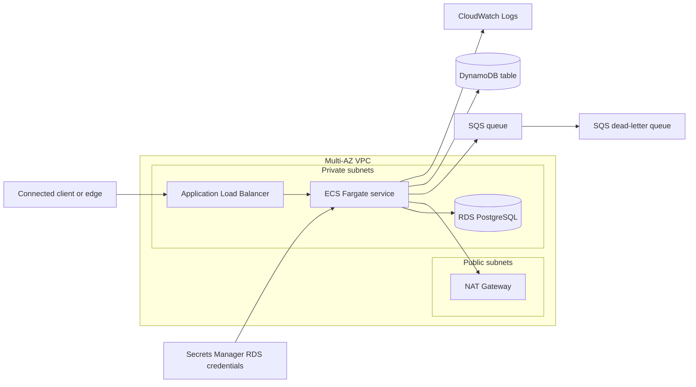

# AWS connected application platform

Composes five published templates into a production-minded application platform:
multi-AZ networking, a private ECS Fargate service, private PostgreSQL, durable
asynchronous messaging, and serverless key-value storage. The example shows how
to pass outputs directly between stacks, share a security-group identity, inject
an RDS-managed secret, and grant the container narrowly scoped data-plane IAM.

## Architecture



The load balancer is internal by default. For an internet-facing deployment it
moves to public subnets, while tasks and PostgreSQL remain in private subnets.
The example creates no bastion, VPN, private endpoint, DNS record, WAF, or CDN;
those are environment-specific edge and operations decisions.

## Composed templates

| Component | Template | Connection |
|---|---|---|
| Network | `templates/aws/vpc` | Supplies VPC, public subnets, and private subnets |
| Runtime | `templates/aws/ecs-fargate-service` | Runs the image and receives all downstream configuration |
| Database | `templates/aws/rds-postgresql` | Accepts only the ECS data-client security group |
| Messaging | `templates/aws/sqs-queue` | Queue URL becomes an app setting; queue ARN scopes task IAM |
| Key-value data | `templates/aws/dynamodb-table` | Table name becomes an app setting; table/index ARNs scope task IAM |

OpenTofu builds the dependency graph from these references. No remote-state
lookups, copied resource IDs, or wrapper tooling are required.

## Prerequisites

- OpenTofu 1.8 or newer;
- AWS credentials with permission to create VPC, EC2 networking, ECS, IAM, ALB,
  RDS, Secrets Manager, SQS, DynamoDB, CloudWatch, and Application Auto Scaling
  resources;
- a container image available to Fargate in the selected region/architecture;
- an application that listens on `container_port` and returns a successful HTTP
  response from `health_check_path`.

For a private ECR image, the normal ECS execution role can pull it. Other private
registries require credentials and an extension to the ECS template.

## Deploy

```bash
aws sts get-caller-identity
cp example.tfvars terraform.tfvars
# Replace container_image and review every cost/protection flag.
tofu init
tofu plan -out=architecture.tfplan
tofu apply architecture.tfplan
```

The default internal endpoint is reachable only from networks routed to the VPC
and permitted by `allowed_ingress_cidrs`. Output the endpoint with:

```bash
tofu output -raw service_url
```

An initial apply creates chargeable resources and can take several minutes,
especially RDS, NAT Gateway, and the Application Load Balancer. This repository
does not apply the example in CI because cloud credentials and a disposable AWS
account are intentionally not assumed.

## Application contract

The ECS task receives these non-secret environment variables:

| Variable | Value |
|---|---|
| `AWS_REGION` | Selected deployment region |
| `DATABASE_HOST` | Private RDS hostname |
| `DATABASE_PORT` | PostgreSQL port (`5432`) |
| `DATABASE_NAME` | Initial PostgreSQL database |
| `SQS_QUEUE_URL` | Source queue URL |
| `DYNAMODB_TABLE_NAME` | DynamoDB table name |

`DATABASE_CREDENTIALS` is injected from the RDS-managed Secrets Manager secret.
Its value is the secret's JSON document, not merely a password, so the container
must parse the JSON fields provided by RDS. The credential never appears in an
OpenTofu output or application setting value.

The task role receives only source-queue message operations and item/query
operations for the configured DynamoDB table and its indexes. The execution role
receives `secretsmanager:GetSecretValue` only for the RDS credential secret. Add
new services by extending `task_role_policy_statements` with exact actions and
ARNs; do not replace these statements with broad managed policies.

## Network and security flow

- The ALB accepts traffic only from `allowed_ingress_cidrs`; an empty set denies
  CIDR ingress.
- ALB traffic reaches the ECS-owned task security group only on
  `container_port`.
- ECS tasks also attach a shared data-client security group. PostgreSQL accepts
  port 5432 only from that group, avoiding a module dependency cycle.
- RDS is never publicly accessible and spans private subnets in at least two
  availability zones.
- ECS tasks receive no public IP. NAT or equivalent VPC endpoints/egress are
  required for image pulls, logs, secrets, and AWS API calls.
- SQS uses server-side encryption and a restricted DLQ. DynamoDB is encrypted,
  protected from deletion, and continuously backed up by default.

For an internet-facing service, set `internal_load_balancer = false`, pass the
required ACM `certificate_arn`, and choose deliberate ingress CIDRs. Add Route 53, AWS WAF,
CloudFront, ALB access logging, and organization-specific controls in a consuming
environment rather than weakening the private default here.

## Important flags and cost

| Flag | Default | Impact |
|---|---:|---|
| `enable_nat_gateway` | `false` | Opt in when private tasks do not have equivalent endpoints/egress; adds hourly/data cost |
| `single_nat_gateway` | `true` | Reduces development cost but creates a cross-zone dependency |
| `internal_load_balancer` | `true` | Keeps the application endpoint private |
| `desired_count` | `1` | Minimizes initial compute cost but is not task-level highly available |
| `database_instance_class` | `db.t4g.micro` | Small development database; size from workload evidence |
| `database_multi_az` | `false` | A standby improves availability and roughly doubles database compute |
| `database_deletion_protection` | `true` | Requires a deliberate two-step database destroy |
| `dynamodb_deletion_protection` | `true` | Requires a deliberate two-step table destroy |
| `dynamodb_point_in_time_recovery` | `true` | Adds continuous backup cost and recovery capability |
| `queue_fifo` | `false` | FIFO changes producer requirements and throughput semantics |
| `enable_flow_logs` | `false` | Improves network visibility with CloudWatch ingestion cost |

NAT Gateway, ALB, Fargate, and RDS have baseline charges even with little
traffic. SQS and on-demand DynamoDB are request-based; CloudWatch Logs, backups,
data transfer, and public IPv4 can add cost. For production, commonly use at
least two ECS tasks, per-zone NAT or VPC endpoints, Multi-AZ RDS, HTTPS/WAF, and
centralized monitoring—after estimating the resulting spend.

## Operations

Before production use:

1. run database migrations as a separate controlled task, not during every app
   startup;
2. alarm on ECS deployment/task health, ALB 5xx/latency, RDS capacity and
   connections, SQS age/DLQ depth, DynamoDB throttling, and NAT errors/cost;
3. test RDS snapshot restore, DynamoDB PITR restore, DLQ inspection/redrive, and
   ECS rollback;
4. pin the container by digest and scan/sign it in the delivery pipeline;
5. store state in an encrypted, locked remote backend with restricted access.

The example is a deployable composition baseline, not a complete landing zone.
Account guardrails, CloudTrail, Config, GuardDuty, budgets, centralized DNS,
identity federation, and CI/CD normally live above this stack.

## Destroy behavior

Protection defaults intentionally make the first `tofu destroy` fail. To remove
the architecture deliberately:

1. set `database_deletion_protection = false` and
   `dynamodb_deletion_protection = false`;
2. keep `database_skip_final_snapshot = false` unless data loss is intentional;
3. run `tofu apply` and verify the protection changes;
4. stop producers and preserve required queue/table data;
5. run `tofu destroy` and confirm the generated RDS final snapshot.

Destroy removes the VPC, NAT, ALB, ECS service, database instance, queues,
DynamoDB table, logs, roles, and security groups managed here. It does not remove
the container image or the final RDS snapshot. Snapshot storage continues to
cost money until separately deleted.
